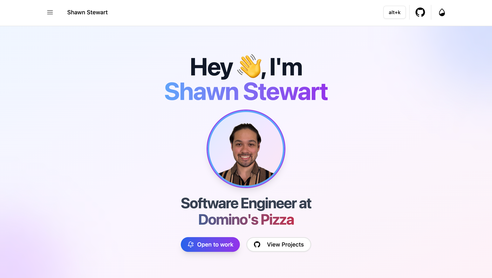

[](https://github.com/ShawnStewart/react-pwa/actions/workflows/ci.yaml)
[](https://github.com/ShawnStewart/react-pwa/actions/workflows/tests:e2e.yaml)

<a href="https://react-pwa-rosy.vercel.app/" target="_blank" rel="noreferrer">
 
</a>

# Starter template for modern web applications!

This project is a template for modern web applications, built with React, Vite, and TypeScript. The goal of this project is to provide a solid foundation for building modern web applications with best practices and a great developer experience.

**Forked from [suren-atoyan/react-pwa](https://github.com/suren-atoyan/react-pwa)**

## Table of Contents

- [Tech stack](#tech-stack)
- [Core features](#core-features)
- [Dev tools and tests](#dev-tools-and-tests)
- [Getting started](#getting-started-using-the-template)
- [Live Demo](#live-demo)
- [License](#license)

## Tech stack

- **React**: A JavaScript library for building user interfaces.
- **Vite**: A fast build tool and development server.
- **TypeScript**: A strongly typed programming language that builds on JavaScript.
- **Tailwind CSS**: Utility-first styling.

## Core features

- **Routing**: React Router for client-side routing.
- **UI Components**: Shadcn/ui for accessible and customizable UI components.
- **Theming**: Dark mode support.
- **PWA**: Progressive Web App support with offline capabilities.
- **Error Handling**: Error boundaries and custom error handling.
- **Hotkeys**: Basic hotkeys implementation.

## Dev tools and tests

- **Vite**: Development server and build tool.
- **ESLint**: Opinionated preconfiguration using flat config.
- **Prettier**: Code formatting.
- **Husky**: Git hooks for pre-commit checks.
- **Lint-staged**: Run linters on staged files.
- **Vitest**: Unit testing framework.
- **Playwright**: End-to-end testing framework.

## Opinionated decisions

- **File structure**: Organized into `components`, `sections`, and `pages`.
- **Component structure**: Each component has its own folder with related files.
- **Code styling**: Preconfigured code formatter and linter.

## Getting started using the template

Click the `Use this template` button or you can fork or clone the repo.


Install dependencies:

```bash
pnpm install
```

To run it in development:

```bash
pnpm run dev
```

To create and run a production build:

```bash
pnpm run build

pnpm run preview
# or, to serve over https
pnpm run https-preview
```

There are other scripts as well:

- `prettier:check` - check if all files are formatted according to the rules.
- `prettier:fix` - auto fix prettier errors.
- `lint:check` - check if all files are linted according to the rules.
- `lint:fix` - auto fix lint errors.
- `ts:check` - check if all files are typed according to the rules.
- `test:unit` - run unit tests.
- `test:e2e` - run e2e tests.
- `test:e2e:ui` - run e2e tests in UI mode.
- `preview` - boot up local static web server that serves the files from `dist` folder. It's an easy way to check if the production build looks OK in your local environment.
- `https-preview` - is the same as `preview`, but with HTTPS. It's handy for testing your PWA capabilities in your local environment.

## [Live Demo](https://react-pwa-rosy.vercel.app/)

## License

[MIT](./LICENSE)
